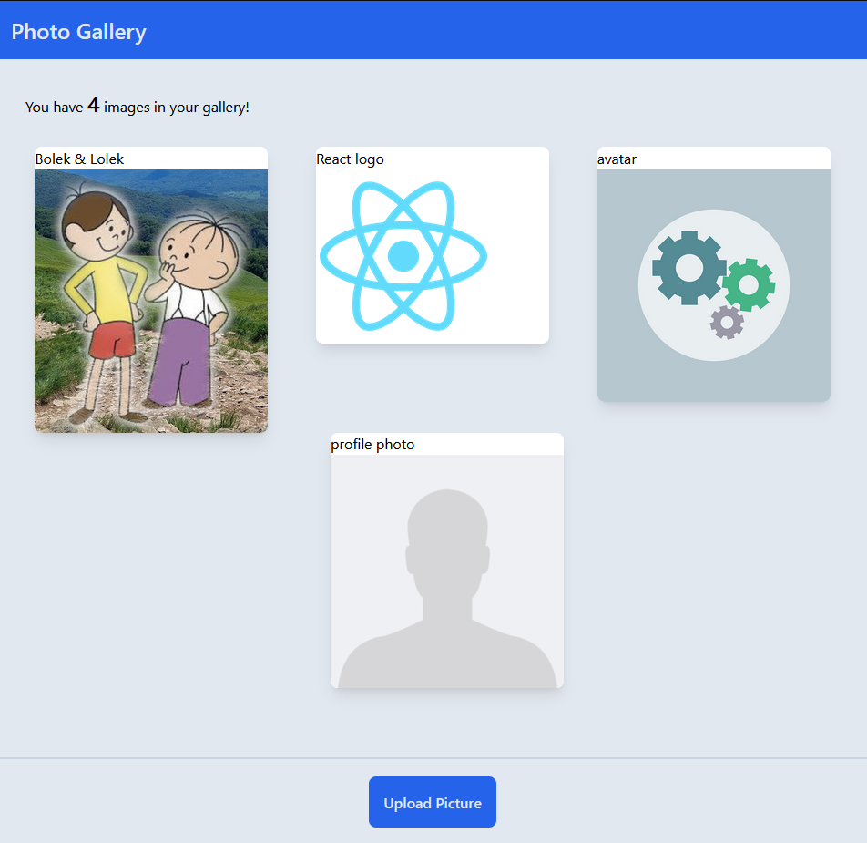
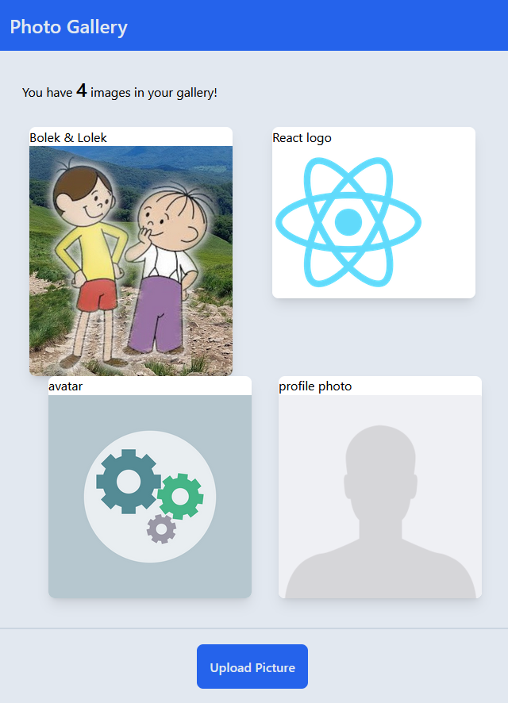
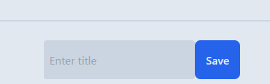

# photo-app
> Study project

Project was created as tool to display pictures that a user can choose from his/her computer files and give them names.
Created to practice working with React DOM, React components, hooks, tailwindcss library and Github pages deployment.

## Table of contents
* [General info](#general-info)
* [Deployment](#deployment)
* [Screenshots](#screenshots)
* [Technologies](#technologies)
* [Setup](#setup)
* [Status](#status)
* [Inspiration](#inspiration)

## General info
Project displays:
* Images that a user uploaded
* Names of photos that a user gives himself
* Reloading the page erases the content

## Deployment
Thanks to Github Pages, I was able to easily deploy the application. You can see and test it yourself!
[>> LINK TO DEPLOYED PHOTO-APP HERE <<](https://muzabol2.github.io/photo-app/)

## Screenshots
When uploaded some photos it will look like this:



It is adapted to display on smaller screens, such as tablets:


After clicking on button "Upload Picture" and choosing a photo from your files, you will need to enter the title for it:


## Technologies
Main:
* React
* html, css

Libraries:
* tailwindcss
* gh-pages

## Setup
Copy repository on your machine. To download all needed dependencies (see package.json to know what they are) type in command line in the repo's location:
```bash
npm install
```
To run application on your local machine type: 
```bash
npm run start
```

## Status
Project is not perfect but for me it is finished. I do not exclude the possibility of further developments, e.g. adding firebase backend, uploading file by drag and drop, refine the CSS, etc.

## Inspiration
Credits for:

Alex Trukhan - for idea and help. Thank you.

And, of course as always - StackOverflow... :)
